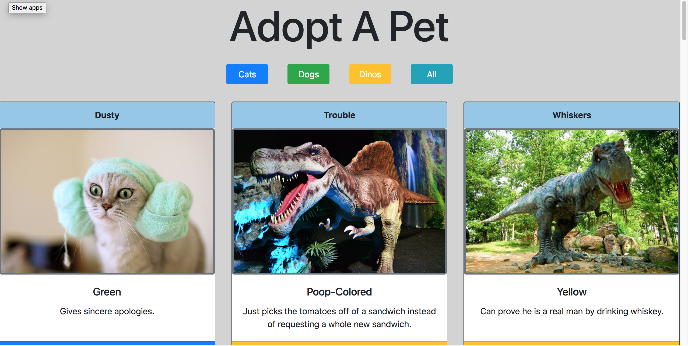

# Adoption Website

- As a user, I want to see a listing of all available pets. Each pet should have a card that has all this data:
- As a user, I want to see 3 category(type) buttons printed at the top of the page. Each should be a different color. These can be hard-coded.
- I want to be able to click one of the 3 buttons, then only the cards that are in the category(type) should show.
- There should be some way for the user to unfilter the results.

## Technical Requirements

- You should be using Bootstrap; your project should look like the mockup displayed.
- You should be using ES6 modules.
- Your code should be clean and readable, with single responsibility principle.

